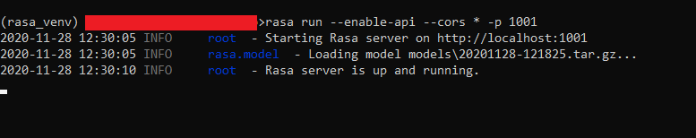

## Getting Started

Let's start with a basic RASA project.

In an empty folder, create a python venv and install RASA in the venv.

## How to run a RASA server

1. Once you've trained an initial model, execute the following command:
   `rasa run --enable-api --cors '*' -p 1001`

   This will start a new RASA server at `localhost:1001` . `--enable-api` and `--cors '*'` are required to let users make requests from outside the RASA ecosystem. `--cors '*'` gives access to everyone, however it can be changed in the future to control who can access the server. '-p' specifies the port. For more on Rasa run, visit this [link](https://rasa.com/docs/rasa/command-line-interface#rasa-run).

   
